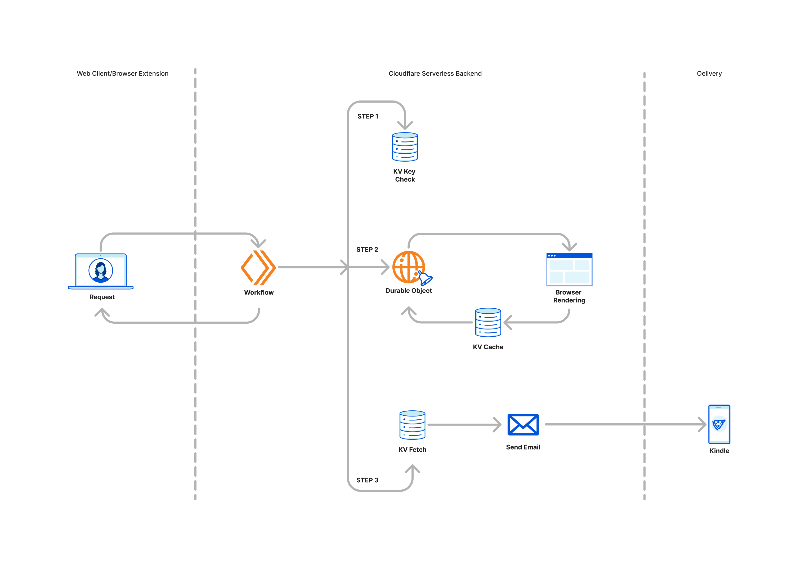

# Web2Kindle 📚
[](https://opensource.org/licenses/MIT)
[](https://github.com/megaconfidence/web2kindle/stargazers)

[](https://deploy.workers.cloudflare.com/?url=https://github.com/megaconfidence/web2kindle)

Transform any web article into a beautifully formatted Kindle ebook with just one click. Web2Kindle is a free and open-source Chrome extension that sends web content directly to your Kindle device for distraction-free reading.

<a href="https://chromewebstore.google.com/detail/web2kindle/kcafopmhdmijjdgckohoecjahhlhbbjk" target="_blank">
  
</a>
<a
  href="https://addons.mozilla.org/en-US/firefox/addon/web2kindle/"
  target="_blank"
>
  
</a>
</br>
</br>

## Features ✨

- 🚀 Lightning-fast delivery to any Kindle device
- 📱 Clean, readable formatting optimized for Kindle screens
- 🔄 One-click sending with automatic URL detection
- 💾 Saves your Kindle email locally for convenience
- 🔒 No account required, no ads, no tracking
- 💯 Free and open source forever

## Architecture



## Installation 🔧

1. Install from [Chrome Web Store](https://chromewebstore.google.com/detail/web2kindle/kcafopmhdmijjdgckohoecjahhlhbbjk) or [Firefox Addons](https://addons.mozilla.org/en-US/firefox/addon/web2kindle/)
2. Add `confidence@megaconfidence.me` to your [Kindle Approved Email List](https://www.amazon.com/gp/help/customer/display.html?nodeId=GX9XLEVV8G4DB28H)
3. Click the extension icon on any webpage you want to read on your Kindle

## How It Works 🛠️

1. The extension captures the current webpage URL
2. Our server processes the content and formats it for Kindle
3. The formatted document is sent to your Kindle email
4. The article appears in your Kindle library within minutes

## Development 👨‍💻

```bash
# Clone the repository
git clone https://github.com/megaconfidence/web2kindle.git

# Install dependencies
npm install

# Run development server
npm run dev

# Deploy app to Cloudflare Workers
npm run deploy
```

## Contributing 🤝

Contributions are welcome! Please feel free to submit a Pull Request. For major changes, please open an issue first to discuss what you would like to change.

1. Fork the Project
2. Create your Feature Branch (`git checkout -b feature/AmazingFeature`)
3. Commit your Changes (`git commit -m 'Add some AmazingFeature'`)
4. Push to the Branch (`git push origin feature/AmazingFeature`)
5. Open a Pull Request

## Support 💬

- [Open an issue](https://github.com/megaconfidence/web2kindle/issues)
- [Email support](mailto:confidence@megaconfidence.me)
- [Documentation](https://github.com/megaconfidence/web2kindle/README.md)

## Privacy 🔒

Web2Kindle respects your privacy:

- No user data collection
- No analytics or tracking
- Email addresses stored locally only
- Open source code for transparency

## License 📄

This project is licensed under the MIT License - see the [LICENSE](LICENSE) file for details.

---

Made with ❤️ by [Confidence Okoghenun](https://github.com/megaconfidence)

[Website](https://web2kindle.megaconfidence.me/) · [Chrome Web Store](https://chromewebstore.google.com/detail/web2kindle/kcafopmhdmijjdgckohoecjahhlhbbjk) · [Report Bug](https://github.com/megaconfidence/web2kindle/issues) · [Request Feature](https://github.com/megaconfidence/web2kindle/issues)
